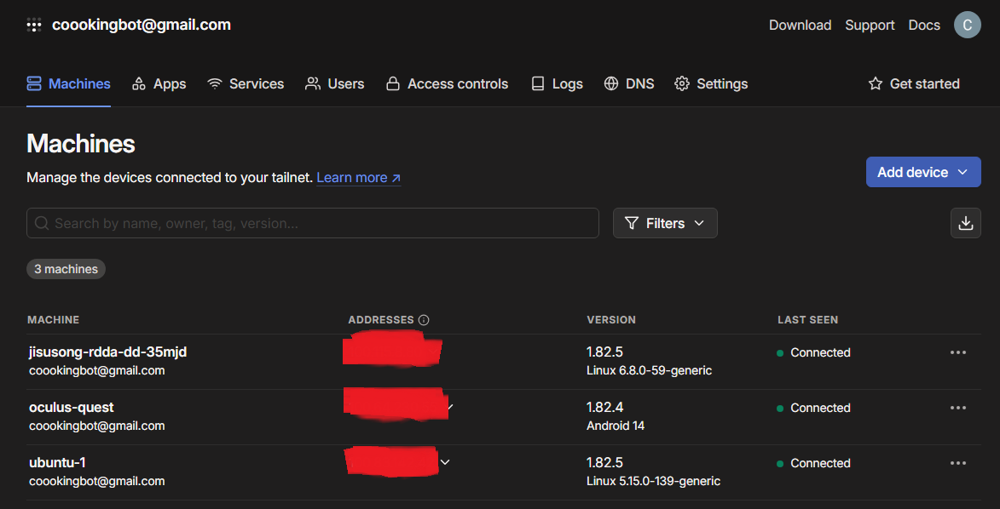

### 과정
컴퓨터와 퀘스트를 연결하는 데 꽤 많은 시간이 들었다. 결국은 roscore를 했을 때 열리는 마스터와 클라이언트가 연결이 돼야 연결이 되는건데 퀘스트의 브라우저에서 아무리 해당 ip와 포트로 접속을 시도해도 연결이 안 되었다. 처음에는 방화벽 문제인 줄 알았는데 그렇지는 않았고 연구실 컴퓨터와 노트북을 연결해 보니까 그냥 vpn으로 하는 게 깔끔하게 연결되는 경향이 있어서 tailscale로 기기를 다 연결하는 하나의 네트워크를 구성하고자 하였기 때문에 단순히 와이파이 연결 문제 외에도 다른 장점이 있다고 생각한다.

그렇다고 그냥 되지는 않았는데 이건 그냥 다른 설정 탓도 있겠으나 그냥 VMWare로 Ubuntu 20.04에 ROS Noetic을 깔아서 실행했더니 됐다.